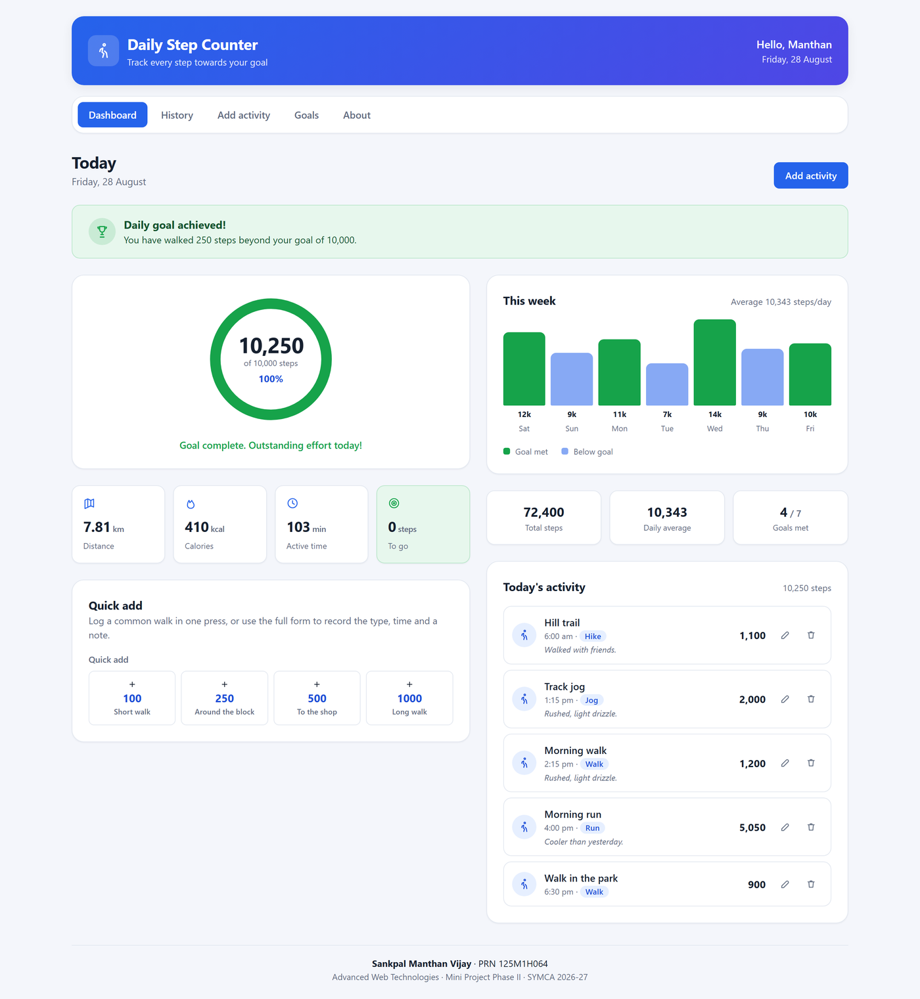

# Daily Step Counter Interface — FA-2 (Phase II)

**Advanced Web Technologies · Mini Project Phase II: Advanced Features, Testing and Deployment**

| | |
|---|---|
| Student | Sankpal Manthan Vijay |
| PRN | 125M1H064 |
| Class | SYMCA · Semester III · A.Y. 2026–27 |
| College | Pimpri Chinchwad College of Engineering, Dept. of MCA |
| Course Owner | Dr. Avinash Chormale |

A React single-page application that records daily walking, measures it against a personal goal,
and keeps a searchable history with full create/read/update/delete support against a REST API.

Phase II extends the Phase I interface with hooks, routing, form validation, API integration,
CRUD, search and filtering, error handling, performance work, automated tests and deployment.



---

## Running the project

Install once:

```bash
npm install
```

Run the API and the web app together:

```bash
npm start
```

That starts JSON Server on **http://localhost:3001** and Vite on **http://localhost:5174**.
To run them separately:

```bash
npm run api
```

```bash
npm run dev
```

Run the tests:

```bash
npm test
```

**Requirements:** Node.js 18 or newer (developed on Node 24, npm 11).

### Working without the API

If JSON Server is not running, the app does not break. The service layer detects the network
failure, falls back to `localStorage`, and shows a "Working offline" banner. This is also what
makes the deployed static build usable without a backend.

---

## Routes

| Route | Screen | Notes |
|---|---|---|
| `/` | Dashboard | Progress ring, derived stats, quick add, weekly chart |
| `/history` | History | Search, type filter, date range, sorting, delete |
| `/activity/new` | Add activity | Full form with field-level validation |
| `/activity/:id/edit` | Edit activity | Same form, pre-populated from the route parameter |
| `/goals` | Goals | Preset and custom daily goal, saved via `PATCH /settings` |
| `/about` | About | Project details and concept-to-code mapping |
| `*` | 404 | Catch-all for unmatched URLs |

Every route except the dashboard is lazy-loaded with `React.lazy` + `Suspense`.

---

## Phase II scope coverage

| Requirement | Where it lives |
|---|---|
| **React Hooks** | `useState`, `useEffect`, `useMemo`, `useCallback`, `useRef`, `useContext`, `useReducer` |
| **Custom hooks** | [useDebounce.js](src/hooks/useDebounce.js), [useLocalStorage.js](src/hooks/useLocalStorage.js), [useDocumentTitle.js](src/hooks/useDocumentTitle.js) |
| **Routing** | [App.jsx](src/App.jsx) — 7 routes, dynamic segment, wildcard, `NavLink` active state |
| **Forms & validation** | [ActivityFormPage.jsx](src/pages/ActivityFormPage.jsx) + [validation.js](src/utils/validation.js) |
| **API integration** | [services/api.js](src/services/api.js) — single `request()` wrapper, `ApiError` type |
| **CRUD** | Create, read, update, delete on `/activities`; update on `/settings` |
| **Search & filter** | [activityFilters.js](src/utils/activityFilters.js) — search, type, date range, 5 sort orders |
| **Error handling** | [ErrorBoundary.jsx](src/components/ErrorBoundary.jsx), `ApiError`, loading/error/empty states, 404 route |
| **Performance** | `React.memo`, `useMemo`, `useCallback`, route code-splitting, debounced search, circuit breaker |
| **Testing** | 130 tests across 6 files — Vitest + React Testing Library |
| **Deployment** | [vercel.json](vercel.json), [netlify.toml](netlify.toml), `public/_redirects` |

---

## Project structure

```
src/
├── main.jsx                  BrowserRouter + StepProvider
├── App.jsx                   Route table, lazy routes, ErrorBoundary
├── pages/                    One component per route
├── components/               Presentational components (props in, callbacks out)
├── context/
│   ├── stepContext.js        createContext + useSteps hook
│   └── StepProvider.jsx      useReducer state machine + CRUD actions
├── hooks/                    useDebounce, useLocalStorage, useDocumentTitle
├── services/api.js           REST calls, ApiError, offline fallback
├── utils/                    metrics, activityFilters, validation, dates (all pure)
├── styles/index.css          Design tokens, layout, components, media queries
└── __tests__/                Vitest + React Testing Library
```

---

## Testing

```bash
npm test
```

130 tests across 6 files, running in about 10 seconds:

| File | Tests | Covers |
|---|---|---|
| `metrics.test.js` | 26 | Distance, calories, progress, weekly aggregates, formatting |
| `validation.test.js` | 29 | Every field rule and the whole-form validator |
| `activityFilters.test.js` | 35 | Search, type filter, date range, sorting, grouping |
| `dates.test.js` | 12 | Local-date helpers (regression tests — see below) |
| `components.test.jsx` | 20 | Rendering, conditional rendering, user interaction |
| `hooks.test.jsx` | 8 | `useDebounce` with fake timers, `useLocalStorage` |

Only the component and hook tests need a DOM; they opt into jsdom with a
`// @vitest-environment jsdom` comment. Everything else runs in Node, which took the suite from
99 seconds down to about 10.

### A bug the tests caught

`buildWeeklyHistory` originally formatted dates with `toISOString().slice(0, 10)`. That converts
to UTC first, so in any timezone ahead of UTC it returned the **previous** calendar day — every
bar on the weekly chart showed the wrong day's total, and "goals met" read 3/7 instead of 4/7.
The fix was [utils/dates.js](src/utils/dates.js), which formats from local date parts;
`dates.test.js` exists to keep it fixed.

---

## Deployment

The production build is a static bundle, so any static host works.

```bash
npm run build
```

Because a single-page application serves every route from one HTML file, the host must rewrite
unknown paths to `index.html` — otherwise opening `/history` directly returns a 404 before React
Router ever runs. That rule is already configured:

- **Vercel** — `vercel.json` (`rewrites`)
- **Netlify** — `netlify.toml` and `public/_redirects`

Set `VITE_API_URL` if you have a hosted API; otherwise the deployed app runs in offline mode and
stores data in the visitor's browser.

---

## Notable design decisions

- **State lives in a reducer, not several `useState` calls.** Loading, success, failure and each
  CRUD result are transitions of one machine, so an impossible combination — loading and error at
  once — cannot be represented.
- **All calculations are pure and framework-free.** `metrics`, `activityFilters`, `validation` and
  `dates` import no React, which is what makes 102 of the 130 tests fast and DOM-free.
- **The context is split in two.** `stepContext.js` holds the context and hook; `StepProvider.jsx`
  holds only the component. A module exporting both breaks React Fast Refresh and forces a full
  page reload on every edit.
- **A circuit breaker guards offline mode.** The first network failure opens it for 30 seconds, so
  later writes skip the doomed request. Offline writes went from **2411 ms to 55 ms**.
